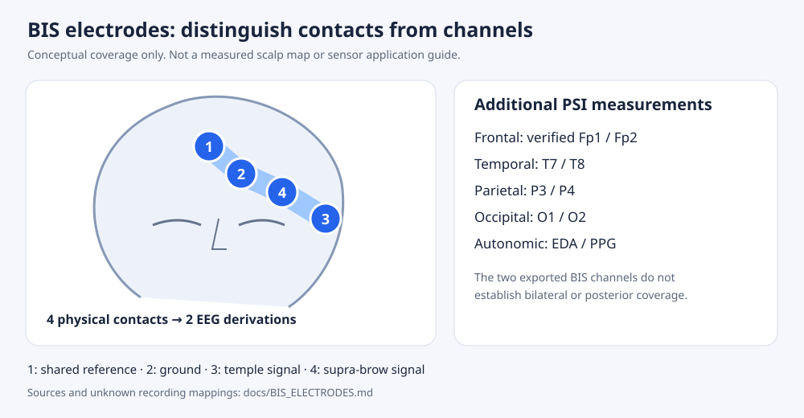

# BIS electrodes and the PSI montage

## Four contacts are not four EEG channels

For conventional Quatro placement, contact 1 acts as the reference, contact 2 as ground, and contacts 3 and 4 provide the two signal derivations against the reference. The two derivations sample nearby forehead/temple activity, with a shared reference. They are not automatically independent left and right hemispheres.

This is a conceptual data-coverage diagram, not a measured electrode-position map or a clinical application guide. Apply actual medical sensors according to the model-specific manufacturer IFU and record the sensor identity, side, physical channel pairs, reference and impedance measurements when available. Never connect disposable sensor contacts directly to an unapproved homemade amplifier.

| Item | Evidence | Software treatment |
| --- | --- | --- |
| Quatro forehead contacts 1/3/4 | Medtronic support page describes their relative placement | Store contact numbers and placement descriptions |
| Reference and two signal derivations | Published Quatro research describes Fpz reference and approximate left frontal F7/Fp1 channels; a separate paper reports pair impedance checks for 1–3 and 1–4 | Conventional configuration is documented; actual export mapping must be separately verified |
| Ground contact 2 | Four-contact strip includes ground; exact individual placement is dictated by its IFU | Ground does not become an EEG signal channel |
| Two VitalDB BIS waveforms | Dataset identifies EEG channels 1 and 2 at 128 Hz | Preserve `BIS_EEG1` and `BIS_EEG2`; no invented scalp labels |
| Sensor side or model in the real excerpt | Not reported by the source track metadata | Unknown, never inferred from channel number |
| Left/right BIS monitoring | Manufacturer identifies a distinct bilateral sensor | Requires verified bilateral sensor/channel metadata |
| Temporal T7/T8 and posterior P3/P4/O1/O2 | Required by the article's proposed topographic features | Additional electrodes and a documented acquisition system |
| EEG current-source density | Requires spatial sampling and a defined estimator | Not substituted with ordinary band power or estimated from a unilateral two-channel strip |

In a published **left-sided** Quatro recording, the scalp locations were approximately F7 and Fp1, referenced to Fpz. Approximate correspondence in one research setup is not an exact 10–20 map for every sensor. The code never applies that correspondence automatically.

## Article coverage

| Article component | BIS-only feasibility | What is required for the full component |
| --- | --- | --- |
| Posterior alpha burst variance | Unavailable | Posterior electrodes, operational burst definition and enough bursts |
| Stimulus-locked gating efficiency | Unavailable from ordinary resting EEG | Synchronized stimulus events and a prospectively defined gating task |
| Posterior gamma | Unavailable | Posterior electrodes plus reviewed EMG/artifact control |
| Frontoparietal PLV | Unavailable | Verified frontal and parietal sites/reference |
| Autonomic surge | Unavailable from the EEG strip | Time-aligned EDA/GSR and PPG/HR data |
| Temporal beta/gamma CSD | Unavailable | Appropriate spatial montage and independently reviewed CSD method |
| Global delta/alpha ratio | Only a frontal descriptor is available | Coverage consistent with the defined global estimator |
| Bifrontal bicoherence | Exploratory auto-bicoherence only | Verified bifrontal channels and an agreed estimator; auto-bicoherence is not automatically the article component |
| Hemispheric asymmetry | Unavailable with an unverified unilateral strip | Verified bilateral homologous pairs and reference |
| Frontotemporal connectivity | Unavailable | Frontal plus T7/T8 electrodes and reference |

The sample report therefore provides qEEG descriptors while both composite indices remain unavailable.

## Extended acquisition specification

The attached article calls its design “8 channels” while counting two reference/ground contacts and six EEG contacts. Reference and ground are not two additional signal channels. It also writes `P3/O1` and `P4/O2` without choosing a precise site, but subsequently specifies Fp1–P3 and Fp2–P4 connectivity.

`configs/psi_extended.json` resolves that ambiguity transparently as an **expanded research specification**: Fp1, Fp2, T7, T8, P3, P4, O1, O2 = eight scalp EEG contacts, plus reference and ground = ten physical contacts. This is an explicit extension, not a claim that the article already describes ten contacts. It supports parietal connectivity and occipital spectral features independently. It does not establish a clinically sufficient CSD montage.

## Sampling and artifact considerations

- VitalDB BIS EEG is 128 Hz, with a Nyquist frequency of 64 Hz. The software restricts its spectral features to 0.5–40 Hz.
- BIS device EMG numerics are not reconstructed from that export; higher-frequency device processing is outside its bandwidth.
- Frontal gamma-band power may contain eye/muscle artifacts. High SQI does not prove the absence of EMG or physiological confounding.
- Shared references can induce spurious connectivity. PLV is a descriptor; it does not establish causal connectivity or a disorder.
- A four-second window is too short for reliable 0.5 Hz temporal structure or many higher-order estimates. Bicoherence uses 60 seconds, and unimplemented event/burst/CSD features remain missing.
- Manufacturer material specifies short-term Quatro use up to 24 hours. The article's longer trajectories require a separately specified and validated acquisition/replacement protocol.

## Primary sources

1. [Medtronic Quatro product and sensor notes](https://www.medtronic.com/en-us/healthcare-professionals/products/patient-monitoring/brain-monitoring/brain-sensors/bis-quatro-sensor.html).
2. [Medtronic BIS Complete 2-channel monitor support, application description](https://www.medtronic.com/covidien/pt-pt/support/products/brain-monitoring/bis-complete-2-channel-monitor.html).
3. [Giattino et al. 2017: left-sided Quatro frontal EEG acquisition](https://www.frontiersin.org/journals/systems-neuroscience/articles/10.3389/fnsys.2017.00024/full).
4. [Harada et al. 2021: Quatro sensor and pair impedance checks](https://journals.plos.org/plosone/article?id=10.1371/journal.pone.0258647).
5. [VitalDB track definitions and acquisition rates](https://vitaldb.net/docs/?documentId=OpenDataset/Overview.md).

